通过一个简单的龙书D3D12案例，从大体上简单浏览一下整个渲染流程。

## DX12渲染管线

顶点处理 -> 曲面细分 -> 几何shader -> 坐标系矩阵变换 -> 光栅化 -> 像素着色器 -> 各种测试 -> 后处理

UE5渲染源码的三件事情：1）代码本身；2）用什么样子的参数，哪些输入的数据，数据的格式；3）真正的数据。

## 什么是RHI

UE为了实现跨平台和对于OpenGL,DX以及VK的兼容性而实现的图形api接口封装层

## 龙书D3D12基础案例

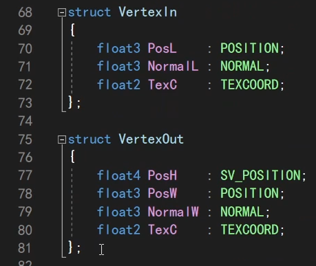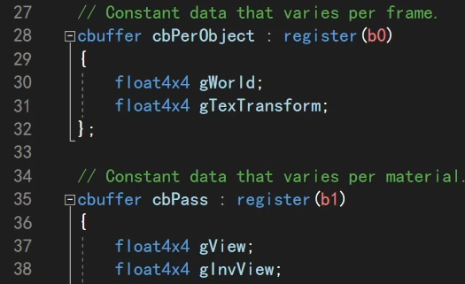

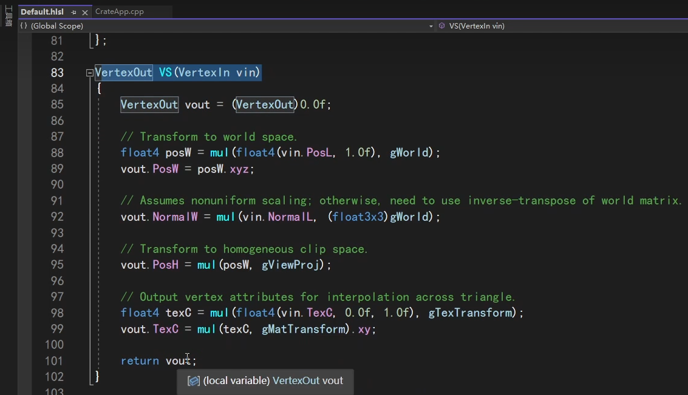

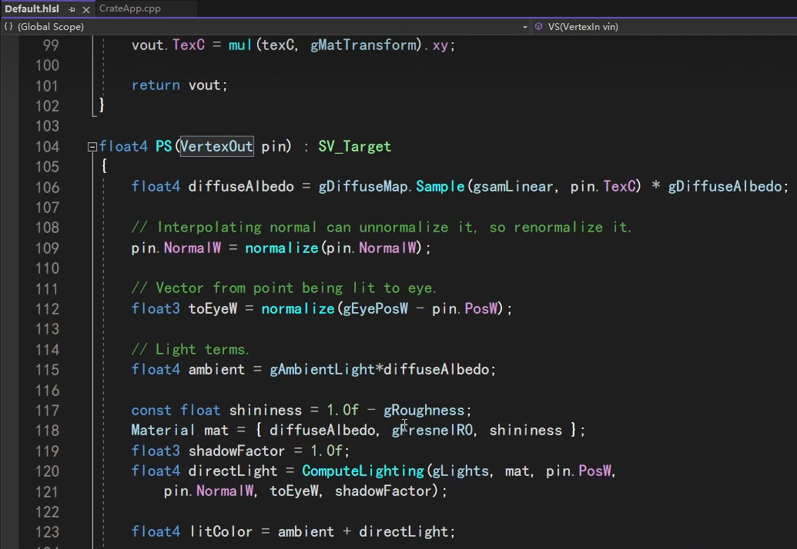

以龙书的D3D12示例Shader代码为例：

VS和PS是顶点着色和像素着色，处理输入，返回输出。

cBuffer - register(bN):b表示constant buffer,N为input slot (0-15),能使用的为0-13,预留2个插槽供内部使用

此阶段的要素是：变量、constant buffer(用于传递变量)、输入输出的结构体、着色代码

应用到渲染管线，1）把代码编译传进去。2）规定参数格式。3）传入数据。

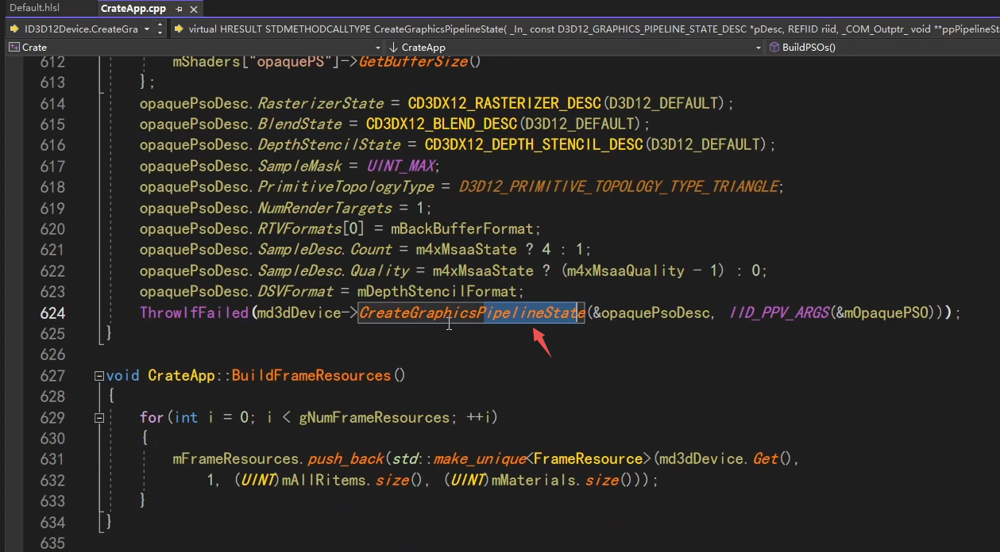

对于D3D12的代码跟参数格式，就是在PipelineState里面。即一个管线的所有状态，包括了整个管线的代码格式，以及某些流程的设置状态。

如果要执行不同的着色器代码，那就按照不同的配置，创建不同的PipelineState，然后到时候决定用哪个pipelinestate。

创建之前，它需要一堆参数。

这是把编译好的代码放进去，实际是一段内存的指针和size。

然后是各种状态的设置。

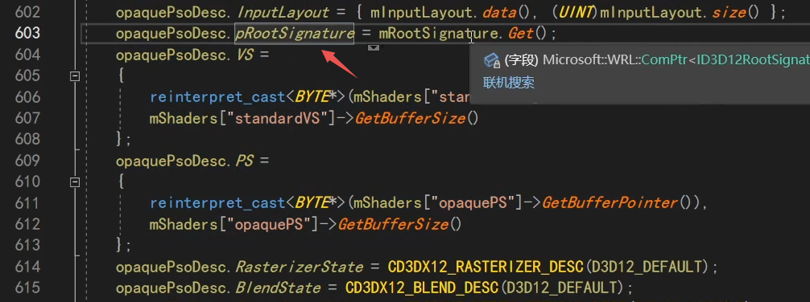

以及根签名，对应了下面代码的一些输入参数格式。先封装成一个根签名再放进来。

何为根签名：
GPU上有很多寄存器，比如t，比如b，比如s。
每个寄存器有很多位置，比如b1,b2
一个着色器在定义上就表明自己会在哪个寄存器上找资源，比如cbuffer obPerObject :register(b0)
到了渲染的时候，着色器要去各种寄存器上取资源的时候，我们要把资源放到寄存器上面去。
所以在渲染之前，就用SetGraphicsRootDescriptorTable方法，把【这函数参数的结构】和【各种资源、位置、大小、类型等信息（就是描述符）】绑定起来。
所以在使用SetGraphicsRootDescriptorTable之前，我们要使用SetGraphicsRootSignature方法和SetDescriptorHeap的方法，知道【这函数参数的结构】（用index）和【各种资源、位置、大小、类型等信息（就是描述符）】(描述符指针地址) 的源数据是哪里。因为有很多根签名，也有很多描述符。
根据根签名定义的参数结构去取得资源。具体取得的过程需要借助述符的数据。
描述符会指定资源数据，还会告知资源即将被绑定在流水线的哪个阶段上。
取得数据会放到寄存器上，然后着色器会依次使用它们。
完成渲染。

[^根签名和资源加载的理解]: https://blog.csdn.net/u014038143/article/details/83067300

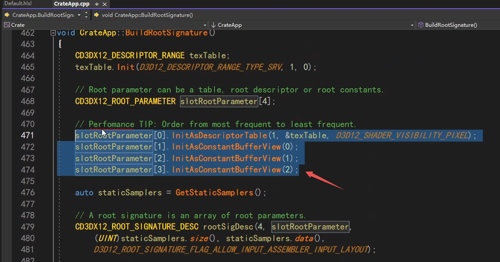

根签名就是设置这些。这里不是传真正的值，只是传参数格式。0是贴图。另外3个是constant buffer，是b0 b1 b2。

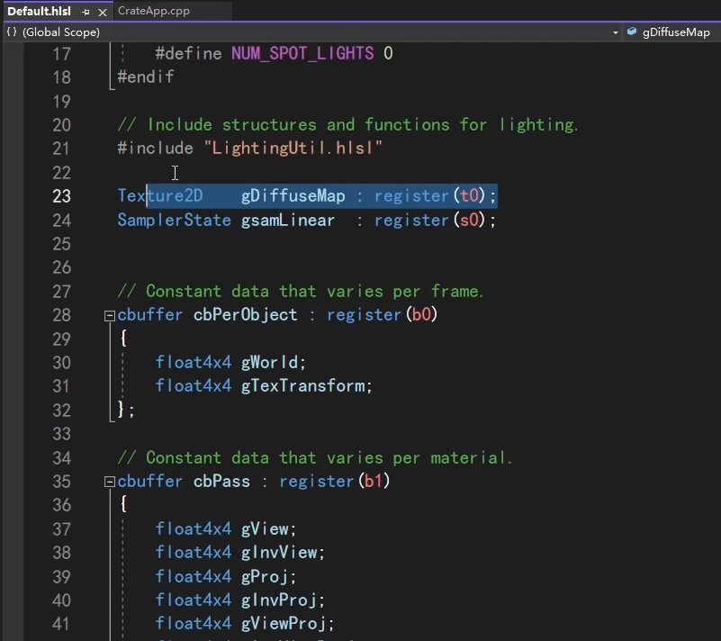

这里的参数有t0, s0, b0, b1, b2。其中s0特殊，在其他地方设置，其他4个，就是上面根签名设置的那4个。

tbuffer - 像纹理Texture那样来访问其中的数据,语法为register(tN),t表示纹理,N 为input slot (0-127)。
纹理并不能直接绑定到着色器中,需要为纹理创建对应的着色器资源视图才能够给着色器使用，所以需要一个采样器。

Smapler - cpp中通过SetGraphicsRootDescriptorTable为HLSL中的gDiffuseMap赋值,然后,调用Texture的采样方法,进行纹理采样。SamplerState语法为register(sN),s表示采样器,s为inputslot(0-127)。

设置完成，然后打包成一个描述。

然后用这个描述，去真正创建一个根签名（rootsignature）。

所以，根签名虽然它要设置很多东西，但它就是着色器的输入格式，然后要用来生成pipelinestate。

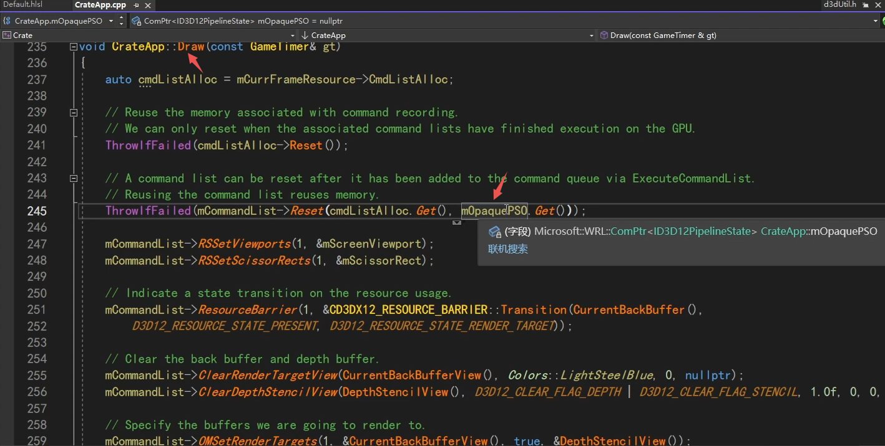

真正去驱动GPU每帧渲染是这个Draw，告诉GPU用我们的渲染状态和刚才设置的PSO（pipelinestateobject）。

pso和rootsignature，都要设置好。

然后GPU就知道代码在哪里了，代码的格式是怎样子的。

剩下就是把参数传进去。当然中间还要设置很多其他状态，但那些不是重点，按龙书格式了解即可。

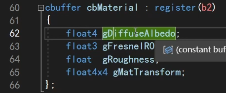

那我们要传真正的参数，比如这个float4的浮点数，它真正的参数在哪？

中间有些别的过程，一堆内存传到GPU变成显存，这里是告诉它gpu的虚拟指针。

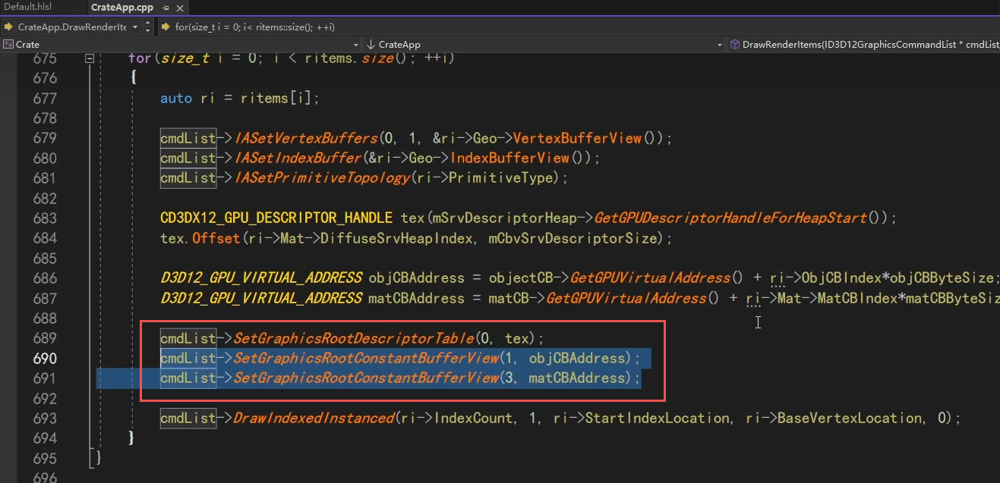

不止上面，还有这里，将t0 b1 b2等参数传进去。

最后就是去执行这个Draw。即完成了一次Draw Call

刚才说的是一些全局的参数，还有顶点的属性，也需要传进去。(顶点buffer、索引buffer、三角形类型等。)

到此结束，因此要看UE渲染的源码，主要就是要关注UE是如何封装这些东西：

各种代码、代码的格式、各种各样的参数、各种各样的设置状态。

所有的参数和设置状态，其实都是一段内存，或者一段显存，就是一个D3D12的Resource资源。

在OpenGL也是同理，把这段内存传进去，OpenGL就会返回一个无符号整数，其实就是一个resourceID。

在UE里，所有资源的基类，就是这个FRHIResource，一个抽象的资源。

总结：一个资源就是一段内存或现存，可以是一个buffer，const buffer。在UE里是Uniform Buffer。可以是张贴图，Texture。可以是Sample，或者是一个State状态。

